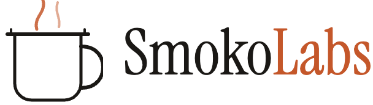

   
  
    
  <strong>Independent Software · Brisbane</strong>
   
  We build focused products — APIs, tools, and platforms — that solve real problems with minimal fuss.
    

---

In Australia, **smoko** is the sacred break — the fifteen minutes where you step away from the job, grab a coffee, and let your brain unspool. It's where the best ideas happen.

**Smoko Labs** is a small, independent software company based in Brisbane. We're not a startup. We're not chasing a round. We're a lab — we tinker, we test, we ship.

### Products

| Product | Description | Status |
|---------|-------------|--------|
| **Servo** | Australian Fuel Price API | Coming Soon |

### Principles

**Laconic** — Say less. Mean more.
**Competent** — Technical rigour without jargon.
**Warm** — Approachable without being twee.
**Independent** — Build what should exist. Price it fairly.

---

  Australian-built, technically rigorous, deliberately small.

